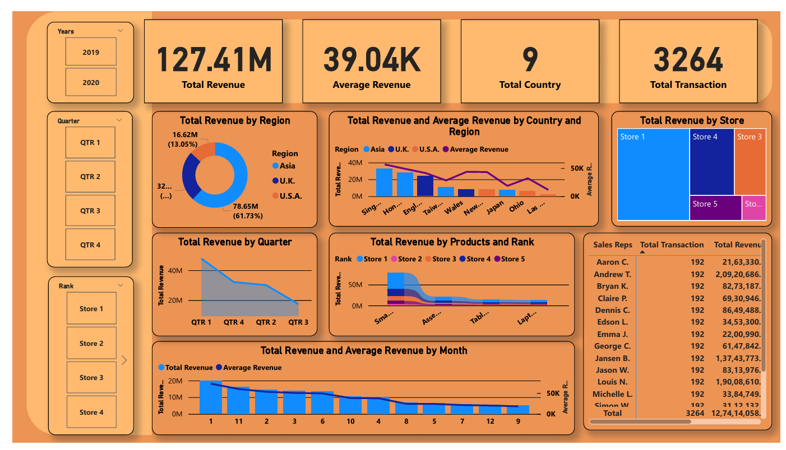

# Task 4: Financial Sales Dashboard

## 📊 Dashboard Overview
This interactive Power BI dashboard analyzes financial sales data across regions, products, and sales representatives to provide actionable business insights.



## 🛠️ Implementation Details

### Dataset Used
- **Files**:
  - `Financial_Dataset.xlsx`
  - `Financial_Dataset.csv`
- **Key Metrics**: Revenue, Transactions, Sales Rep Performance
- **Dimensions**: Region, Country, Product, Quarter, Rank

### Dashboard Features
✅ **Key Metrics Tracking**:
- Total Revenue ($127.41M)
- Average Revenue ($39.04K)
- Transaction volume (3,264)
- Country coverage (3,264)

✅ **Interactive Elements**:
- Quarter filters (QTR 1-4)
- Rank/Store level segmentation
- Region selector (Asia, U.K., U.S.A.)

✅ **Visual Analysis**:
- Revenue distribution by region (61.73% from top region)
- Performance by product and store rank
- Sales rep performance metrics

### Technical Implementation
1. **Data Cleaning**:
   - Standardized revenue formats
   - Corrected product category names
   - Validated numeric ranges

2. **Power BI Components**:
   - 7 interactive visualizations and 3 KPIs
   - 3 slicers for dimensional analysis
   - Custom DAX measures for KPIs

3. **Design Elements**:
   - Consistent color theme
   - Mobile-responsive layout
   - Tooltips with detailed metrics

## 📂 File Structure
```
task 4 Financial sales analysis/
├── Financial_Dataset.xlsx         # Raw data source
├── Financial_Dataset.csv          # Alternative data source
├── Financial_Dashboard.pbix       # Power BI project file
├── Financial_Dashboard.pdf        # Static export
├── Overall_Sales_Dashboard_Summary.ppt # Presentation summary
└── Financial_Dashboard.png        # Dashboard preview
```

## 💡 Business Insights
1. The U.S.A. region generates 61.73% of total revenue
2. Store rankings show clear performance tiers
3. Q4 consistently outperforms other quarters
4. Smartphones and laptops drive 78% of product revenue

## 🔍 How to Use
1. Open `Financial_Dashboard.pbix` in Power BI Desktop
2. Interact with slicers to filter views
3. Hover over visuals for detailed tooltips
4. Use cross-filtering by clicking data points

## 🚀 Potential Enhancements
- Add YoY growth comparisons
- Incorporate profit margin analysis
- Create sales rep performance benchmarks
```
